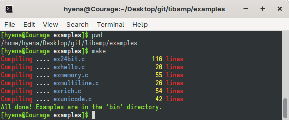
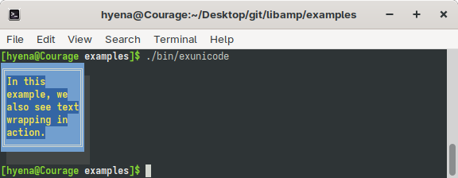
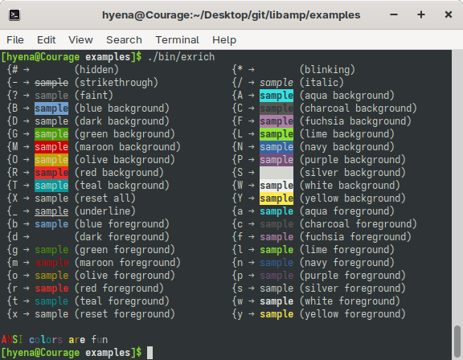
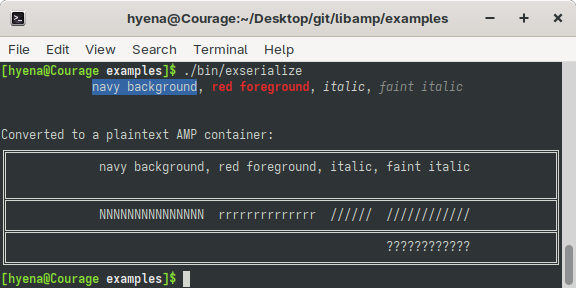
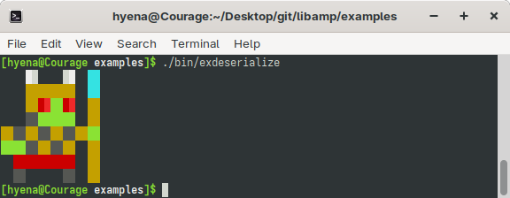
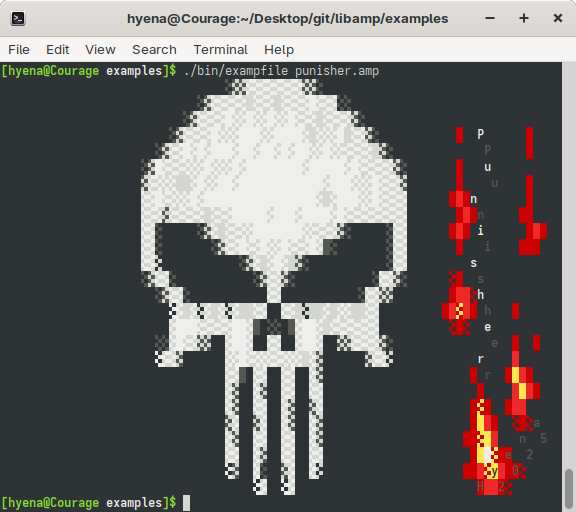
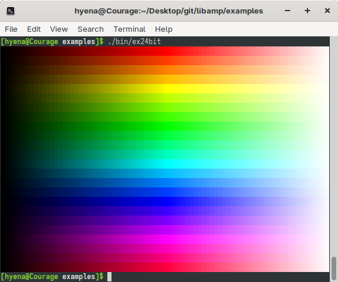
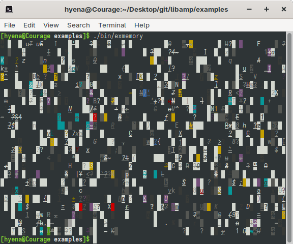

# LibAMP Readme ################################################################

* Home: https://github.com/1Hyena/libamp
* Issue tracker: https://github.com/1Hyena/libamp/issues

In LibAMP, the letters AMP stand for "ANSI Map" (as in ANSI art), and the Lib
prefix indicates that it is a library for the C programming language.

## What is AnsMap ##############################################################

AnsMap (AMP) is a data structure that stores the instructions for printing ANSI
art graphics to the terminal. The AnsMap Library is accompanied by a set of
methods for ansmap construction and for the conversion of ansmap images to ANSI
escape code sequences.

In this context, an ansmap is a digital text-based image represented as a grid
of individual cells called glyphs. Each glyph stores color and style information
to form a complete picture.

The AnsMap Library offers a specialized application programming interface (API)
designed for creating terminal applications and games like multi-user dungeons
(MUDs) and _roguelikes_. It includes the following features:

* **Header-only:** The AnsMap Library is implemented in a single header file
  with no dependencies other than the standard C library.

* **Non-allocating:** LibAMP does not involve any heap memory allocations.

* **UTF8-only:** The library expects UTF-8 encoding of the input text and does
  not attempt to detect Unicode encoding errors.

* **Multi-palette:** The generated ANSI escape sequences can include color codes
  either specific to the standard 16 color palette or to the 24 bit true color
  mode.

* **Text wrapping:** The LibAMP API allows for multiline text drawing with the
  user specified maximum line width parameter.

* **Inline style markers:** In rich text printing, style information can be
  embedded into the source text at the location where the style needs to be
  applied.

* **Portable:** LibAMP builds and functions on Linux. It should be relatively
  simple to make it run on most other platforms as long as the platform provides
  the C standard library.

* **Permissive license:** LibAMP is available under the [MIT license](LICENSE).

## Installation ################################################################

Clone the repository and include the header file in your project. Compile using
a C compiler (C23 or later required).

## Using LibAMP ################################################################

The usage of the library can be divided into two main parts: drawing and
rendering. The following sections provide a brief overview of each.

### Drawing ansmap images ######################################################

To create an ansmap image, you can include the [amp.h](amp.h) header file
directly in your codebase. The library is implemented in a single C header file
for easy integration.

The main functions to use for drawing are `amp_init()` and `amp_draw_text()`.
The initialization function is necessary to specify the image resolution and
data buffer. The text drawing function takes the initialized ansmap pointer as
an argument and prints the desired text on it.

While the initialization of the ansmap data structure typically requires an
external data buffer for storing the image state in memory, it can be omitted.
If omitted, the library will try to use the limited amount of integrated memory
associated with each ansmap. The amount of integrated memory is defined by the
`AMP_BUF_SIZE` macro, which the user can define according to their needs in each
compilation unit.

To determine the size of the external data buffer before initialization, the API
provides the `amp_calc_size()` function, which takes the image resolution as its
arguments.

### Rendering ansmap images ####################################################

To display an ansmap in the terminal, use the `amp_to_ans()` function. It
requires a pointer to the ansmap image structure and a pointer to the memory
location to copy the result. If `nullptr` is used for the memory location, the
output will be written to the standard output of the program.

### Examples ###################################################################

To compile all the examples, run the `make` command in the _examples_ directory.

#### ExUnicode #################################################################

The [exunicode](examples/src/exunicode.c) example demonstrates the library's
ability to represent unicode glyphs on the ansmap. In addition, it features text
wrapping.

https://github.com/1Hyena/libamp/blob/c9d45a1099b8784d06523c6246223e28028ebe84/examples/src/exunicode.c#L21-L36

#### ExRich ####################################################################

The [exrich](examples/src/exrich.c) example prints the list of available rich
text markers with the respective text samples.

https://github.com/1Hyena/libamp/blob/c9d45a1099b8784d06523c6246223e28028ebe84/examples/src/exrich.c#L29-L41

#### ExSerialize ###############################################################

The [exserialize](examples/src/exserialize.c) program generates rich text on an
ansmap, displays the result in the terminal, and exports the ansmap image as an
AMP document, which is also displayed in the terminal.

https://github.com/1Hyena/libamp/blob/c9d45a1099b8784d06523c6246223e28028ebe84/examples/src/exserialize.c#L15-L25

#### ExDeserialize #############################################################

The [exdeserialize](examples/src/exdeserialize.c) example demonstrates how the
human-readable AMP documents can be imported from memory.

https://github.com/1Hyena/libamp/blob/c9d45a1099b8784d06523c6246223e28028ebe84/examples/src/exdeserialize.c#L7-L40

#### ExAmpFile #################################################################

The [exampfile](examples/src/exampfile.c) example is very similar to
[ExDeserialize](#exdeserialize). The only difference is that instead of
deserializing a hardcoded AMP document, the program loads a user specified AMP
file from the file system.

#### Ex24bit ###################################################################

The [ex24bit](examples/src/ex24bit.c) example demonstrates how to use the 24 bit
true color mode when converting the ansmap into a sequence of ANSI escape codes.

https://github.com/1Hyena/libamp/blob/c9d45a1099b8784d06523c6246223e28028ebe84/examples/src/ex24bit.c#L28-L32

#### ExMemory ##################################################################

The [exmemory](examples/src/exmemory.c) example shows how to allocate memory
from the heap and use it for the storage of an ansmap image. It then fills the
image with randomly chosen and styled printable ASCII characters.

https://github.com/1Hyena/libamp/blob/c9d45a1099b8784d06523c6246223e28028ebe84/examples/src/exmemory.c#L17-L49

### API ########################################################################

* [Colors](#colors)
  - [amp_map_rgb](#amp_map_rgb) (*red*, *green*, *blue*) → `struct amp_color_type`
  - [amp_unmap_rgb](#amp_unmap_rgb) (*color*, &*red*, &*green*, &*blue*)
  - [amp_lookup_color](#amp_lookup_color) (*color index*) → `struct amp_color_type`

* [Ansmap creation](#ansmap-creation)
  - [amp_calc_size](#amp_calc_size) (*width*, *height*) → `size_t`
  - [amp_init](#amp_init) (&*ansmap*, *width*, *height*, &*data*, *data size*) → `size_t`

* [Ansmap properties](#ansmap-properties)
  - [amp_get_palette](#amp_get_palette) (&*ansmap*) → `AMP_PALETTE`
  - [amp_get_width](#amp_get_width) (&*ansmap*) → `uint32_t`
  - [amp_get_height](#amp_get_height) (&*ansmap*) → `uint32_t`
  - [amp_get_glyph](#amp_get_glyph) (&*ansmap*, *x*, *y*) → `const char *`
  - [amp_get_style](#amp_get_style) (&*ansmap*, *x*, *y*) → `AMP_STYLE`
  - [amp_get_bg_color](#amp_get_bg_color) (&*ansmap*, *x*, *y*) → `struct amp_color_type`
  - [amp_get_fg_color](#amp_get_fg_color) (&*ansmap*, *x*, *y*) → `struct amp_color_type`

* [Printing operations](#printing-operations)
  - [amp_clear](#amp_clear) (&*ansmap*)
  - [amp_print_glyph](#amp_print_glyph) (&*ansmap*, *style*, *x*, *y*, &*string*)
  - [amp_print_line](#amp_print_line) (&*ansmap*, *style*, *x*, *y*, *alignment*, &*string*)
  - [amp_snprint_linef](#amp_snprint_linef) (&*amp*, *style*, *x*, *y*, *align*, &*buf*, *buf size*, &*fmt*, *...*) → `ssize_t`
  - [amp_print_text](#amp_print_text) (&*ansmap*, *style*, *x*, *y*, *max width*, *alignment*, &*string*) → `size_t`
  - [amp_snprint_textf](#amp_snprint_textf) (&*amp*, *style*, *x*, *y*, *max width*, *align*, &*buf*, *buf size*, &*fmt*, *...*) → `ssize_t`
  - [amp_print_rich_text](#amp_print_rich_text) (&*ansmap*, *style*, *x*, *y*, *max width*, *alignment*, &*string*) → `size_t`
  - [amp_snprint_rich_textf](#amp_snprint_rich_textf) (&*amp*, *style*, *x*, *y*, *max width*, *align*, &*buf*, *buf size*, &*fmt*, *...*) → `ssize_t`
  - [amp_put_glyph](#amp_put_glyph) (&*ansmap*, &*string*, *x*, *y*) → `const char *`
  - [amp_put_style](#amp_put_style) (&*ansmap*, *style*, *x*, *y*) → `bool`
  - [amp_set_bg_color](#amp_set_bg_color) (&*ansmap*, *color*, *x*, *y*) → `bool`
  - [amp_set_fg_color](#amp_set_fg_color) (&*ansmap*, *color*, *x*, *y*) → `bool`

* [Image I/O](#image-io)
  - [amp_set_palette](#amp_set_palette) (&*ansmap*, palette)
  - [amp_to_ans](#amp_to_ans) (&*ansmap*, &*data*, *data size*) → `ssize_t`
  - [amp_row_to_ans](#amp_row_to_ans) (&*ansmap*, *y*, &*data*, *data size*) → `ssize_t`
  - [amp_clip_to_ans](#amp_clip_to_ans) (&*ansmap*, *x*, *y*, *width*, &*data*, *data size*) → `ssize_t`
  - [amp_parse_size](#amp_parse_size) (&*data*, *data size*, &*width*, &*height*) → `size_t`
  - [amp_deserialize](#amp_deserialize) (&*ansmap*, &*data*, *data size*) → `size_t`
  - [amp_serialize](#amp_serialize) (&*ansmap*, settings, &*data*, *data size*) → `ssize_t`
  - [amp_stdout](#amp_stdout) (&*string*, *string size*) → `ssize_t`

#### Colors ####################################################################

##### amp_map_rgb ##############################################################

https://github.com/1Hyena/libamp/blob/c9d45a1099b8784d06523c6246223e28028ebe84/amp.h#L329-L336

Examples:
[ex24bit](https://github.com/1Hyena/libamp/blob/c9d45a1099b8784d06523c6246223e28028ebe84/examples/src/ex24bit.c#L108)

##### amp_unmap_rgb ############################################################

https://github.com/1Hyena/libamp/blob/c9d45a1099b8784d06523c6246223e28028ebe84/amp.h#L338-L346

##### amp_lookup_color #########################################################

https://github.com/1Hyena/libamp/blob/c9d45a1099b8784d06523c6246223e28028ebe84/amp.h#L348-L353

#### Ansmap creation ###########################################################

##### amp_calc_size ############################################################

https://github.com/1Hyena/libamp/blob/c9d45a1099b8784d06523c6246223e28028ebe84/amp.h#L127-L133

Examples:
[ex24bit](https://github.com/1Hyena/libamp/blob/c9d45a1099b8784d06523c6246223e28028ebe84/examples/src/ex24bit.c#L11),
[exmemory](https://github.com/1Hyena/libamp/blob/c9d45a1099b8784d06523c6246223e28028ebe84/examples/src/exmemory.c#L17)

##### amp_init #################################################################

https://github.com/1Hyena/libamp/blob/c9d45a1099b8784d06523c6246223e28028ebe84/amp.h#L135-L146

Examples:
[exhello](https://github.com/1Hyena/libamp/blob/c9d45a1099b8784d06523c6246223e28028ebe84/examples/src/exhello.c#L9),
[exunicode](https://github.com/1Hyena/libamp/blob/c9d45a1099b8784d06523c6246223e28028ebe84/examples/src/exunicode.c#L9),
[exmultiline](https://github.com/1Hyena/libamp/blob/c9d45a1099b8784d06523c6246223e28028ebe84/examples/src/exmultiline.c#L9),
[ex24bit](https://github.com/1Hyena/libamp/blob/c9d45a1099b8784d06523c6246223e28028ebe84/examples/src/ex24bit.c#L22),
[exmemory](https://github.com/1Hyena/libamp/blob/c9d45a1099b8784d06523c6246223e28028ebe84/examples/src/exmemory.c#L28)

#### Ansmap properties #########################################################

##### amp_get_palette ##########################################################

https://github.com/1Hyena/libamp/blob/c9d45a1099b8784d06523c6246223e28028ebe84/amp.h#L391-L394

##### amp_get_width ############################################################

https://github.com/1Hyena/libamp/blob/c9d45a1099b8784d06523c6246223e28028ebe84/amp.h#L381-L384

##### amp_get_height ###########################################################

https://github.com/1Hyena/libamp/blob/c9d45a1099b8784d06523c6246223e28028ebe84/amp.h#L386-L389

##### amp_get_glyph ############################################################

https://github.com/1Hyena/libamp/blob/c9d45a1099b8784d06523c6246223e28028ebe84/amp.h#L248-L256

##### amp_get_style ############################################################

https://github.com/1Hyena/libamp/blob/c9d45a1099b8784d06523c6246223e28028ebe84/amp.h#L270-L276

##### amp_get_bg_color #########################################################

https://github.com/1Hyena/libamp/blob/c9d45a1099b8784d06523c6246223e28028ebe84/amp.h#L289-L296

##### amp_get_fg_color #########################################################

https://github.com/1Hyena/libamp/blob/c9d45a1099b8784d06523c6246223e28028ebe84/amp.h#L309-L316

#### Printing operations #######################################################

##### amp_clear ################################################################

https://github.com/1Hyena/libamp/blob/c9d45a1099b8784d06523c6246223e28028ebe84/amp.h#L148-L151

Examples:
[exrich](https://github.com/1Hyena/libamp/blob/c9d45a1099b8784d06523c6246223e28028ebe84/examples/src/exrich.c#L36)

##### amp_print_glyph ##########################################################

https://github.com/1Hyena/libamp/blob/c9d45a1099b8784d06523c6246223e28028ebe84/amp.h#L161-L169

Examples:
[exmemory](https://github.com/1Hyena/libamp/blob/c9d45a1099b8784d06523c6246223e28028ebe84/examples/src/exmemory.c#L42)

##### amp_print_line ###########################################################

https://github.com/1Hyena/libamp/blob/c9d45a1099b8784d06523c6246223e28028ebe84/amp.h#L171-L181

Examples:
[exhello](https://github.com/1Hyena/libamp/blob/c9d45a1099b8784d06523c6246223e28028ebe84/examples/src/exhello.c#L15)

##### amp_snprint_linef ########################################################

https://github.com/1Hyena/libamp/blob/c9d45a1099b8784d06523c6246223e28028ebe84/amp.h#L445-L466

##### amp_print_text ###########################################################

https://github.com/1Hyena/libamp/blob/c9d45a1099b8784d06523c6246223e28028ebe84/amp.h#L183-L197

Examples:
[exmultiline](https://github.com/1Hyena/libamp/blob/c9d45a1099b8784d06523c6246223e28028ebe84/examples/src/exmultiline.c#L15),
[exunicode](https://github.com/1Hyena/libamp/blob/c9d45a1099b8784d06523c6246223e28028ebe84/examples/src/exunicode.c#L21)

##### amp_snprint_textf ########################################################

https://github.com/1Hyena/libamp/blob/c9d45a1099b8784d06523c6246223e28028ebe84/amp.h#L396-L418

##### amp_print_rich_text ######################################################

https://github.com/1Hyena/libamp/blob/c9d45a1099b8784d06523c6246223e28028ebe84/amp.h#L364-L379

##### amp_snprint_rich_textf ###################################################

https://github.com/1Hyena/libamp/blob/c9d45a1099b8784d06523c6246223e28028ebe84/amp.h#L420-L443

Examples:
[exrich](https://github.com/1Hyena/libamp/blob/c9d45a1099b8784d06523c6246223e28028ebe84/examples/src/exrich.c#L29)

##### amp_put_glyph ############################################################

https://github.com/1Hyena/libamp/blob/c9d45a1099b8784d06523c6246223e28028ebe84/amp.h#L258-L268

##### amp_put_style ############################################################

https://github.com/1Hyena/libamp/blob/c9d45a1099b8784d06523c6246223e28028ebe84/amp.h#L278-L287

##### amp_set_bg_color #########################################################

https://github.com/1Hyena/libamp/blob/c9d45a1099b8784d06523c6246223e28028ebe84/amp.h#L298-L307

Examples:
[ex24bit](https://github.com/1Hyena/libamp/blob/c9d45a1099b8784d06523c6246223e28028ebe84/examples/src/ex24bit.c#L106)

##### amp_set_fg_color #########################################################

https://github.com/1Hyena/libamp/blob/c9d45a1099b8784d06523c6246223e28028ebe84/amp.h#L318-L327

#### Image I/O #################################################################

##### amp_set_palette ##########################################################

https://github.com/1Hyena/libamp/blob/c9d45a1099b8784d06523c6246223e28028ebe84/amp.h#L153-L159

Examples:
[ex24bit](https://github.com/1Hyena/libamp/blob/c9d45a1099b8784d06523c6246223e28028ebe84/examples/src/ex24bit.c#L30)

##### amp_to_ans ###############################################################

https://github.com/1Hyena/libamp/blob/c9d45a1099b8784d06523c6246223e28028ebe84/amp.h#L199-L212

Examples:
[exhello](https://github.com/1Hyena/libamp/blob/c9d45a1099b8784d06523c6246223e28028ebe84/examples/src/exhello.c#L16),
[exunicode](https://github.com/1Hyena/libamp/blob/c9d45a1099b8784d06523c6246223e28028ebe84/examples/src/exunicode.c#L38),
[exmultiline](https://github.com/1Hyena/libamp/blob/c9d45a1099b8784d06523c6246223e28028ebe84/examples/src/exmultiline.c#L22),
[ex24bit](https://github.com/1Hyena/libamp/blob/c9d45a1099b8784d06523c6246223e28028ebe84/examples/src/ex24bit.c#L31),
[exmemory](https://github.com/1Hyena/libamp/blob/c9d45a1099b8784d06523c6246223e28028ebe84/examples/src/exmemory.c#L49)

##### amp_row_to_ans ###########################################################

https://github.com/1Hyena/libamp/blob/c9d45a1099b8784d06523c6246223e28028ebe84/amp.h#L214-L228

##### amp_clip_to_ans ##########################################################

https://github.com/1Hyena/libamp/blob/c9d45a1099b8784d06523c6246223e28028ebe84/amp.h#L230-L246

##### amp_parse_size ###########################################################

https://github.com/1Hyena/libamp/blob/c9d45a1099b8784d06523c6246223e28028ebe84/amp.h#L490-L504

Examples:
[exdeserialize](https://github.com/1Hyena/libamp/blob/c9d45a1099b8784d06523c6246223e28028ebe84/examples/src/exdeserialize.c#L20)

##### amp_deserialize ##########################################################

https://github.com/1Hyena/libamp/blob/c9d45a1099b8784d06523c6246223e28028ebe84/amp.h#L506-L517

Examples:
[exdeserialize](https://github.com/1Hyena/libamp/blob/c9d45a1099b8784d06523c6246223e28028ebe84/examples/src/exdeserialize.c#L30)

##### amp_serialize ############################################################

https://github.com/1Hyena/libamp/blob/c9d45a1099b8784d06523c6246223e28028ebe84/amp.h#L468-L488

Examples:
[exserialize](https://github.com/1Hyena/libamp/blob/c9d45a1099b8784d06523c6246223e28028ebe84/examples/src/exserialize.c#L25)

##### amp_stdout ###############################################################

https://github.com/1Hyena/libamp/blob/c9d45a1099b8784d06523c6246223e28028ebe84/amp.h#L355-L362

Examples:
[exhello](https://github.com/1Hyena/libamp/blob/c9d45a1099b8784d06523c6246223e28028ebe84/examples/src/exhello.c#L17),
[exunicode](https://github.com/1Hyena/libamp/blob/c9d45a1099b8784d06523c6246223e28028ebe84/examples/src/exunicode.c#L39),
[exmultiline](https://github.com/1Hyena/libamp/blob/c9d45a1099b8784d06523c6246223e28028ebe84/examples/src/exmultiline.c#L23),
[ex24bit](https://github.com/1Hyena/libamp/blob/c9d45a1099b8784d06523c6246223e28028ebe84/examples/src/ex24bit.c#L32),
[exmemory](https://github.com/1Hyena/libamp/blob/c9d45a1099b8784d06523c6246223e28028ebe84/examples/src/exmemory.c#L50)

## License #####################################################################

The AnsMap Library has been authored by Erich Erstu and is released under the
[MIT](LICENSE) license.
